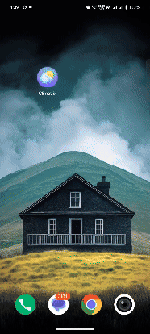

# Climatrix
"Climatrix is a weather app built with Flutter that provides real-time weather updates based on location, allows city-based searches, and displays a 5-day forecast with graphical trends.

# Climatrix Weather App

A simple and intuitive weather app built with Flutter, utilizing the Bloc architecture. This app displays the current weather for the user's location, offers a search functionality for other cities, and provides a 5-day weather forecast displayed in a graphical format.

## Features

- *Current Location Weather:* Automatically fetches and displays the current weather based on the user's location.
- *City Search:* Search field allows users to find the weather for any city.
- *5-Day Forecast:* Displays a 5-day forecast with a graph showing weather trends over time.
- *Reload Button:* Refreshes weather data for the current location.

## Packages Used

Below are the main packages used in this project:

- *flutter_bloc*: For state management using the Bloc pattern ([flutter_bloc on pub.dev](https://pub.dev/packages/flutter_bloc))
- *http*: To handle API requests and fetch weather data ([http on pub.dev](https://pub.dev/packages/http))
- *geolocator*: For accessing the device's location to get current weather based on user location ([geolocator on pub.dev](https://pub.dev/packages/geolocator))
- *fl_chart*: To display a line graph for the 5-day weather forecast ([fl_chart on pub.dev](https://pub.dev/packages/fl_chart))

## Getting Started

### Prerequisites

- *Flutter*: Make sure you have Flutter installed. You can download it from [Flutter's official website](https://flutter.dev/).
- *API Key*: Sign up for an API key from a weather API provider like [OpenWeatherMap](https://openweathermap.org/) for accessing weather data.

### Installation

1. *Clone the repository:*
  
  - git clone https://github.com/ABHISHEK-VM/Climatrix.git
  - cd Climatrix
   
2. *Install dependencies:*

   flutter pub get
   
3. *Configure API Key*

    Go to lib/core/constants/api_constants.dart (or wherever you've configured your API constants).

    - Add your API key in the placeholder.
    - const String apiKey = 'YOUR_API_KEY';
   
5. *Run the App:*

    flutter run
   
### Usage
 *Current Location Weather*
  - Upon opening the app, it will request location permission.
  - Once granted, the app automatically fetches and displays weather data for the user's current location.
 *Search Field*
  - Use the search field at the top of the screen to search for weather in a specific city.
  - Type the city name and press "Search" to fetch the weather data for the specified location.
 *5-Day Forecast*
  - Navigate to the "Forecast" screen to view a 5-day weather forecast.
  - The forecast is displayed in a graph format, showing weather conditions over the selected period, with each point representing a day's weather.
 *Reload Button*
  - The reload button allows you to manually refresh the current location's weather data.
    
### Design Choices
*Bloc Architecture:* 
 - Chosen for its ability to separate the business logic from the UI, making the app more scalable, testable, and maintainable.
*UI/UX:*
 - The app was designed with simplicity in mind, providing easy access to essential weather information and offering a clean, user-friendly interface.

## Challenges
*Location Permissions:* 
 - Ensuring the app handles location permissions effectively, especially when permissions are denied or restricted.
*Graph Rendering:*
 - Creating a clear and interactive graph display for the 5-day forecast data required careful layout and data handling.

## Additional Features
*Graph Interactivity:* 
 - Added interactive elements to the 5-day forecast graph for better user engagement.
   
*Seach by city:*
 - Added the ability to search for weather data by city, providing more flexibility for users to view weather information for different locations.

## Folder Structure

The folder structure is organized as follows:
The app follows the *Bloc (Business Logic Component)* architecture, which helps in managing state and makes the app more scalable, testable, and maintainable.

- *lib/*: Main folder for app code.
  - *bloc/*: Contains Bloc files for managing app states and events.
  - *models/*: Data models for weather and forecast details.
  - *screens/*: UI screens for current weather, search, and forecast.
  - *core/*: Constants and helper functions.

## Acknowledgments

- Special thanks to [OpenWeatherMap](https://openweathermap.org/) for providing their APIs, which power the weather data in this app.
- This app was inspired by various resources from the *Flutter community* and *Bloc architecture* tutorials. A big thank you to all the contributors who have shared their knowledge and resources!

## Prototype

You can view the prototype of the app here: [Prototype Link](https://www.figma.com/proto/1e3rBI1qPuKTQb04fQrKxe/Untitled?node-id=21-2335&node-type=frame&t=JRFk0cL5dqoYI1pU-1&scaling=scale-down&content-scaling=fixed&page-id=0%3A1)

## APK

Download the APK of the app here: [Download APK](https://drive.google.com/drive/folders/1q-UGkQnwUQz-MTiv9dLk0xGMxGpL15hw?usp=sharing)